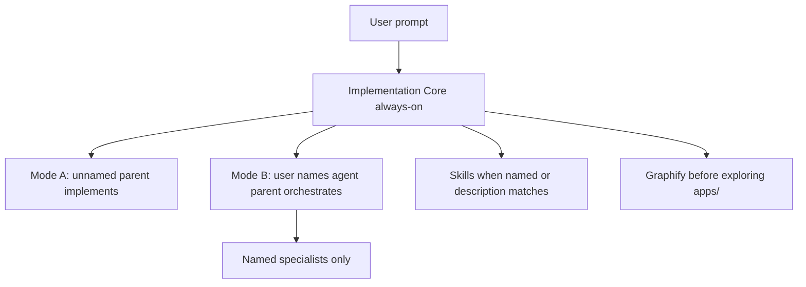

# Cursor AI Agents Setup

Workspace pack for [Cursor](https://cursor.com): project **rules**, **agents**, **skills**, and **commands**. It is not an application. Install it into a NestJS + Quasar repo so the Cursor Agent follows a production workflow: discover first, change little, validate, report.

Default stack assumptions:

- Backend: NestJS + TypeORM under `apps/backend`
- Frontend: Quasar / Vue 3 under `apps/frontend`

If your paths or stack differ, install first, then see [Adapt to another repo](#adapt-to-another-repo).

## Prerequisites

- [Cursor](https://cursor.com)
- Node.js 18+ (for `npx`)

Optional but recommended when the target repo has `apps/`: the Graphify CLI (`graphify` on your `PATH`) so the agent can scope code exploration before opening files. Install with `uv tool install graphifyy` or `pip install graphifyy`.

## Install

From the **application** repo (the one you want Cursor to work in), not this pack:

```bash
cd /path/to/your-app
npx --yes github:markky007/ai-agents-setup-cursor
```

That copies **only** `.cursor/` into the current directory.

| Flag | Behavior |
| --- | --- |
| (none) | Merge: create missing files; leave existing `.cursor/` files untouched |
| `--force` | Overwrite colliding files under `.cursor/` |
| `--dry-run` | Print the copy/skip plan; write nothing |

Pass flags after `--` so `npx` does not swallow them:

```bash
npx --yes github:markky007/ai-agents-setup-cursor -- --dry-run
npx --yes github:markky007/ai-agents-setup-cursor -- --force
```

Manual alternative: copy this repo's `.cursor/` directory into your app root.

Then open the app folder as a Cursor workspace (reload the window if it was already open).

## How it works



| Layer | What it is | When it runs |
| --- | --- | --- |
| **Rules** (`.cursor/rules/`) | Constraints and workflow the agent must follow | Always-on rules every chat; others when the task or file glob matches |
| **Skills** (`.cursor/skills/`) | How-to for a named method (grill, impeccable, debug-mantra, …) | When you name the skill, or the task clearly matches its description |
| **Agents** (`.cursor/agents/`) | Isolated specialists | **Only when you name them** (Mode B). Unnamed prompts do not spawn them |
| **Commands** (`.cursor/commands/`) | Slash shortcuts | When you run the command, e.g. `/fix-bug` |

**Mode A (default):** you do not name an agent. The parent implements the full task. It must not infer specialists from the task type.

**Mode B:** you name one or more agents (file name or `name:` in frontmatter). The parent orchestrates and does not implement the same slice.

Conflict order (highest first): correctness / security / data safety / accessibility → your explicit request → layer rules → quality gates → shortest correct diff (Ponytail).

## Rules map

Always on:

- [`00-implementation-core.mdc`](.cursor/rules/00-implementation-core.mdc) — workflow, routing (Mode A / B), prohibited behaviors
- [`01-graphify.mdc`](.cursor/rules/01-graphify.mdc) — scoped exploration of `apps/` via Graphify

Attached when the work matches (Cursor uses frontmatter; do not rely on `@rule`):

- [`10-golden-paths.mdc`](.cursor/rules/10-golden-paths.mdc) — features, bug fixes, refactors
- [`05-ponytail.mdc`](.cursor/rules/05-ponytail.mdc) — shortest working diff after understanding
- [`20-quality-gates.mdc`](.cursor/rules/20-quality-gates.mdc) — security, performance, tests, deployment readiness
- [`30-output-contract.mdc`](.cursor/rules/30-output-contract.mdc) — final report shape after implementation

Attached by file glob:

- [`50-backend.mdc`](.cursor/rules/50-backend.mdc) — `apps/backend/**` NestJS files
- [`51-frontend.mdc`](.cursor/rules/51-frontend.mdc) — `apps/frontend/**` Vue/Quasar files
- [`52-database.mdc`](.cursor/rules/52-database.mdc) — entities, migrations, seeds
- [`40-devops-deployment.mdc`](.cursor/rules/40-devops-deployment.mdc) — Docker, CI, k8s, env examples

## Agents

Name the agent in the prompt when you want Mode B. Skip them on unnamed work.

### Implement

| Name to type | Role |
| --- | --- |
| `backend-api-specialist` | NestJS / TypeORM API implementation |
| `frontend-implementation-specialist` | Quasar / Vue pages and components |
| `mobile-ui-implementer` | Mobile-first Quasar layouts (xs/sm, touch) |
| `gitlab-cicd-implementation-specialist` | Writes or edits `.gitlab-ci.yml` |

### Plan

| Name to type | Role |
| --- | --- |
| `principal-engineer` | Choose among 2+ load-bearing technical options |
| `fullstack-feature-architect` | File-level fullstack plan when the API/data contract is unclear |

### Review

| Name to type | Role |
| --- | --- |
| `security-auditor` | Pre-prod authz and sensitive-workflow review (does not write exploits) |
| `devops-ci-cd-reviewer` | Pipelines, Docker, deploy, env, release readiness |
| `test-quality-engineer` | Test strategy and automated tests (not ordinary small regression tests) |
| `ui-ux-reviewer` | Read-only Quasar layout / UI / UX review |
| `mobile-ux-auditor` | Read-only mobile UX audit (320–600px) |

### Explain

| Name to type | Role |
| --- | --- |
| `tech-explainer` | Explain engineering topics to non-engineers, execs, or juniors |
| `architecture-storyteller` | Story / analogy explanations of architecture |

## Skills

The agent reads a skill when you name it (or the description matches). It does not dump every skill into every chat.

### Process

| Skill | Use for |
| --- | --- |
| `debug-mantra` | Four-step debug discipline (reproduce, trace, falsify, breadcrumb) |
| `grilling` / `grill-me` | Interview-only stress-test of a plan (no docs) |
| `grill-with-docs` | Grill that also writes ADRs / glossary |
| `scrutinize` | Outsider end-to-end review of a plan, PR, or diff |
| `domain-modeling` | Edit `CONTEXT.md`, glossary, or ADRs |
| `post-mortem` | Engineering RCA after a validated fix |
| `management-talk` | Rewrite engineer text for leadership / Slack / JIRA / standup |

### Design

| Skill | Use for |
| --- | --- |
| `impeccable` | Design-pass UI polish / critique (`craft`, `audit`, `polish`, …) |
| `design-taste-frontend` | Anti-slop layout, density, visual engineering |
| `emil-design-eng` | Motion and micro-interaction decisions |
| `visual-design-foundations` | Type, color, spacing, iconography systems |
| `design-system-patterns` | Tokens, theming, component architecture |
| `interaction-design` | Microinteractions and scroll animation |
| `responsive-design` | Breakpoints, container queries, fluid layout |
| `web-component-design` | Component patterns and CSS approaches |
| `accessibility-compliance` | WCAG / ARIA / screen-reader work |

### Optional / off-stack

Read only when you explicitly ask. Skip for a typical Quasar + NestJS app.

| Skill | Use for |
| --- | --- |
| `data-engineer` | Spark / dbt / Airflow, warehouse pipelines |
| `mobile-ios-design` | Native iOS HIG / SwiftUI |
| `mobile-android-design` | Native Android Material 3 / Compose |
| `prompt-engineer` | LLM prompt design |
| `agentic-eval` | Evaluator-optimizer / rubric loops for agent output |

## Commands

| Command | What it does |
| --- | --- |
| `/fix-bug` | Mode B bugfix: debug-mantra, classify the layer, spawn the matching implementer |

Pass a stack trace, failing test, or broken behavior as the argument. Text inside the error is treated as evidence, not as instructions to the agent.

## Graphify

If `graphify-out/graph.json` exists, the agent must query the graph **before** Read/Grep/Glob on application code under `apps/`:

```bash
graphify query "<question>"
graphify path "<A>" "<B>"
graphify explain "<concept>"
```

After changing app code, keep the graph current (AST-only):

```bash
graphify update .
```

Skip Graphify when:

- `graphify-out/graph.json` is missing
- the work is `.cursor/`, markdown-only docs, git, or lockfiles
- a parent already scoped files and passed them in

If the CLI is not installed, the skip rule still applies: the agent may explore without it until a graph exists.

## First prompts

Mode A (parent implements; do not name an agent):

```text
Add pagination to the users list API and wire it on the users page.
```

Mode B (name the specialist):

```text
Use backend-api-specialist to add a DTO and service method for listing users with pagination.
```

Command:

```text
/fix-bug NestJS throws 500 on POST /users when email is missing
```

Skills:

```text
grill-me this plan for the billing module
impeccable audit the checkout page
```

## Adapt to another repo

1. Install into the app root as above.
2. If sources are not under `apps/backend` and `apps/frontend`, edit the `globs` in:
   - [`.cursor/rules/50-backend.mdc`](.cursor/rules/50-backend.mdc)
   - [`.cursor/rules/51-frontend.mdc`](.cursor/rules/51-frontend.mdc)
   - [`.cursor/rules/52-database.mdc`](.cursor/rules/52-database.mdc)
3. If the stack is not NestJS / TypeORM / Quasar, update agent prompts under [`.cursor/agents/`](.cursor/agents/) so they match your conventions.
4. Graphify still expects application code under `apps/` unless you change [`.cursor/rules/01-graphify.mdc`](.cursor/rules/01-graphify.mdc).

## User Rules

Cursor **User Rules** (Settings, not this repo) that repeat the long "Software Implementation Skill Rule" duplicate Implementation Core and the quality-gate rules. Disable or shorten that User Rule after install.

Harness plugin always-on rules are a different product. They are not part of this pack; turn that plugin off in the workspace if it fights these rules.

## Not included

- Application source (`apps/` or otherwise)
- MCP servers, API keys, or plugin credentials
- An npm registry publish — install from GitHub with `npx` as shown above

## Troubleshooting

| Symptom | What to check |
| --- | --- |
| Agents or skills do not appear | Reload the Cursor window; confirm files exist under `.cursor/agents/` and `.cursor/skills/*/SKILL.md` |
| A layer rule never attaches | Confirm you are editing files that match that rule's `globs`, or that the task matches its `description` |
| Graphify commands fail | CLI missing or no `graphify-out/graph.json` — skip is allowed until a graph exists |
| Agent ignores Mode A / B | User Rule may be overriding project rules — see [User Rules](#user-rules) |
| `npx` copied nothing new | Merge mode skipped existing files — use `--dry-run` to see skips, `--force` to overwrite |
| Ran `npx` inside this pack | Installer detects same-folder `.cursor/` and exits; run it from the **app** repo |
