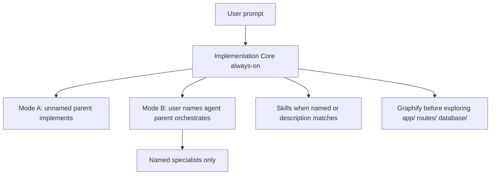

# Cursor AI Agents Setup (Laravel / PHP)

Workspace pack for [Cursor](https://cursor.com): project **rules**, **agents**, **skills**, and **commands** for Laravel. It is not an application. Install it into a Laravel repo so the Cursor Agent follows a production workflow: discover first, change little, validate, report.

Default path assumptions (edit globs if your app differs):

- Laravel code: `app/`, `routes/`, `database/`, `tests/`
- Optional UI rules: `51-blade.mdc`, `51-livewire.mdc`, `51-inertia.mdc` — keep only the ones you use
- Documented framework window: Laravel 13 requires PHP 8.3–8.5 per [Laravel releases](https://laravel.com/docs/13.x/releases). Read the app's `composer.json`; do not assume versions.

## Laravel Boost (in the app, not vendored here)

This pack does **not** copy Laravel Boost skills. In the **application** repo:

```bash
composer require laravel/boost --dev
php artisan boost:install
```

Select Cursor. Boost writes version-aware guidelines, `.cursor/mcp.json` (`php artisan boost:mcp`), and package skills. Keep Boost updated with `php artisan boost:update`.

**Precedence:** this pack wins on Mode A/B, safety, and quality gates. Boost wins on Laravel/package APIs for the installed versions. Do not auto-run Boost `infer-conventions` on unnamed prompts (`disable-model-invocation`).

If Boost generates `AGENTS.md`, treat it as Laravel ecosystem guidance, not a replacement for Implementation Core.

## Prerequisites

- [Cursor](https://cursor.com)
- Node.js 18+ (for `npx`)
- Optional: Graphify CLI (`graphify` on `PATH`) when the app has `graphify-out/graph.json`. PHP AST is supported by graphifyy; quality on a given Laravel tree is unverified until you build a graph.

## Install

From the **Laravel application** repo (the one you want Cursor to work in), not this pack:

```bash
cd /path/to/your-laravel-app
npx --yes github:markky007/ai-agents-setup-cursor-php
```

That copies **only** `.cursor/` into the current directory.

| Flag | Behavior |
| --- | --- |
| (none) | Merge: create missing files; leave existing `.cursor/` files untouched |
| `--force` | Overwrite colliding files under `.cursor/` |
| `--dry-run` | Print the copy/skip plan; write nothing |

Pass flags after `--` so `npx` does not swallow them:

```bash
npx --yes github:markky007/ai-agents-setup-cursor-php -- --dry-run
npx --yes github:markky007/ai-agents-setup-cursor-php -- --force
```

Manual alternative:

```bash
rsync -a \
  /path/to/ai-agents-php/.cursor/ /path/to/your-laravel-app/.cursor/
```

Then open the app folder as a Cursor workspace (reload the window if it was already open). Optional frontend rules are included; delete the `51-*.mdc` files you do not need after copy.

## How it works



| Layer | When it runs |
| --- | --- |
| **Rules** | Always-on: Implementation Core + Graphify. Others by glob or description |
| **Skills** | When named, or description matches. Process/design skills ship here; Laravel how-to comes from Boost in the app |
| **Agents** | **Only when you name them** (Mode B) |
| **Commands** | e.g. `/fix-bug` |

**Mode A (default):** parent implements; 0 specialists inferred.

**Mode B:** you name agents (`laravel-api-specialist`, …). Parent orchestrates.

Conflict order: correctness / security / data safety / accessibility → your request → layer rules → quality gates → shortest correct diff (Ponytail).

## Rules map

Always on:

- [`00-implementation-core.mdc`](.cursor/rules/00-implementation-core.mdc) — workflow, Mode A / B
- [`01-graphify.mdc`](.cursor/rules/01-graphify.mdc) — scoped exploration

Intelligent (description): `05-ponytail`, `10-golden-paths`, `20-quality-gates`, `30-output-contract`

Globs:

- [`50-http-api.mdc`](.cursor/rules/50-http-api.mdc) — `app/Http/**`, `routes/**`, `app/Policies/**`
- [`52-eloquent.mdc`](.cursor/rules/52-eloquent.mdc) — models, migrations, factories, seeders
- [`53-jobs.mdc`](.cursor/rules/53-jobs.mdc) — `app/Jobs/**`, `app/Console/**`
- [`54-tests.mdc`](.cursor/rules/54-tests.mdc) — `tests/**`
- [`40-devops-deployment.mdc`](.cursor/rules/40-devops-deployment.mdc) — Docker, CI, helm, php-fpm/octane configs
- `51-*.mdc` — optional Blade / Livewire / Inertia

If the Laravel app lives in a subdirectory, edit those globs.

## Agents

Name the agent in the prompt for Mode B.

| Name | Role |
| --- | --- |
| `laravel-api-specialist` | Laravel HTTP/API |
| `eloquent-migration-reviewer` | Readonly schema/migration review |
| `frontend-implementation-specialist` | Blade / Livewire / Inertia as present |
| `mobile-ui-implementer` / `mobile-ux-auditor` | Mobile implement vs readonly audit |
| `ui-ux-reviewer` | Readonly layout review |
| `gitlab-cicd-implementation-specialist` | Writes `.gitlab-ci.yml` (never rename variables / restage) |
| `devops-ci-cd-reviewer` | Readonly CI/Docker/deploy review |
| `security-auditor` | Readonly authz/sensitive-workflow review |
| `test-quality-engineer` | Test strategy (not ordinary one-test parent work) |
| `principal-engineer` | Choose among 2+ options |
| `fullstack-feature-architect` | File-level plan when the contract is unclear |
| `tech-explainer` / `architecture-storyteller` | Explain only |

## Commands

| Command | What it does |
| --- | --- |
| `/fix-bug` | Mode B bugfix via debug-mantra + matching specialist |

## Adapt to another repo

1. Install into the Laravel app root as above.
2. Edit globs if paths are not the Laravel skeleton.
3. Install Boost in the app.
4. Enable only the `51-*` rule files that match the UI.
5. Do not add `CLAUDE.md` that duplicates Implementation Core (Cursor always applies `CLAUDE.md`).
6. `CONTEXT.md` stays an app domain file (skill `domain-modeling`).

## Not included

- Application source
- Laravel Boost skills or `mcp.json`
- An npm registry publish — install from GitHub with `npx` as shown above

## User Rules

Disable any Cursor User Rule that duplicates Implementation Core (the long "Software Implementation Skill Rule").

## Troubleshooting

| Symptom | What to check |
| --- | --- |
| Agents or skills do not appear | Reload the Cursor window; confirm files exist under `.cursor/agents/` and `.cursor/skills/*/SKILL.md` |
| `npx` copied nothing new | Merge mode skipped existing files — use `--dry-run` to see skips, `--force` to overwrite |
| Ran `npx` inside this pack | Installer detects same-folder `.cursor/` and exits; run it from the **Laravel app** repo |
| `npx` cannot find the GitHub repo | This pack must be pushed to `github:markky007/ai-agents-setup-cursor-php` (or change the slug in `package.json` / README) |
